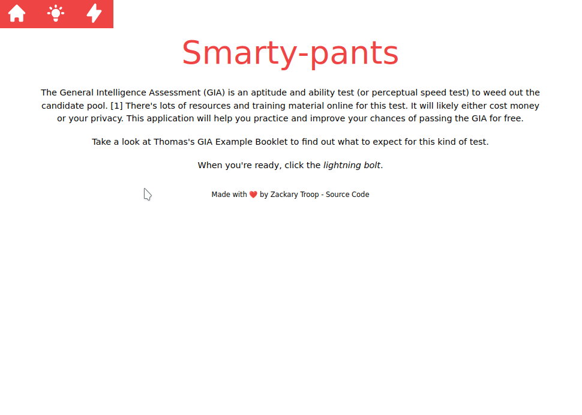

# Summary

The [General Intelligence Assessment (GIA)](https://www.thomas.co/general-intelligence-assessment-gia) is an aptitude and ability test (or perceptual speed test) to weed out the candidate pool.
This is a quick game application to practice the test without signing up or buying practice tests.

It was also a great opportunity to experiment with the Svelte framework.

This is a _work in progress_. I have other game modes that I still need to add.

## More Thoughts

When working with CSS, I often find using `semantic`, `bootstrap`, `bulma` or `tailwindw` is more pragmatic in smaller projects. I think `styled components` make more sense if you plan on sharing individualized components.

I think Svelte and React are both great libraries. I definitely see the appeal with Svelte in that it compiles into a "ready to deploy" set of optimized files.

# Demonstration

